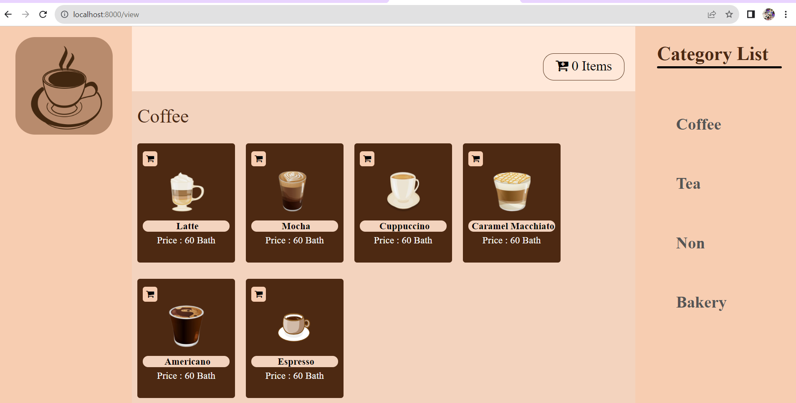
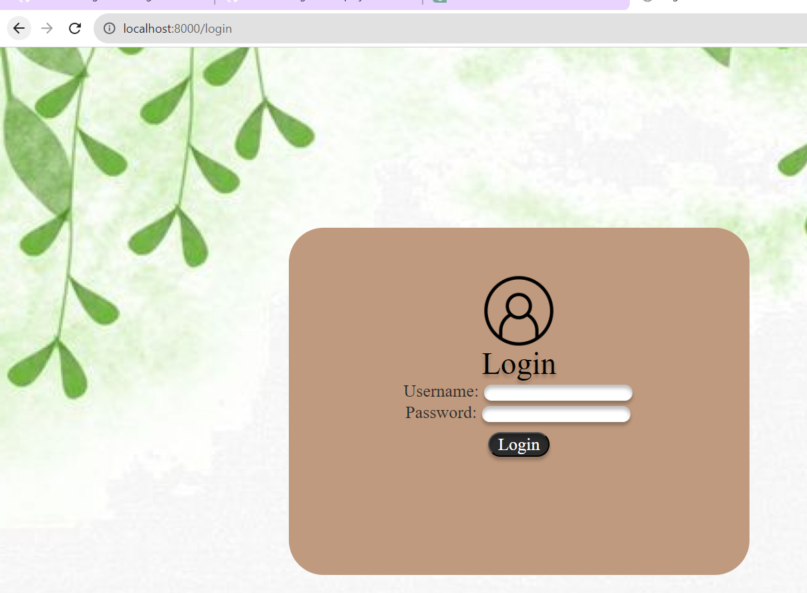
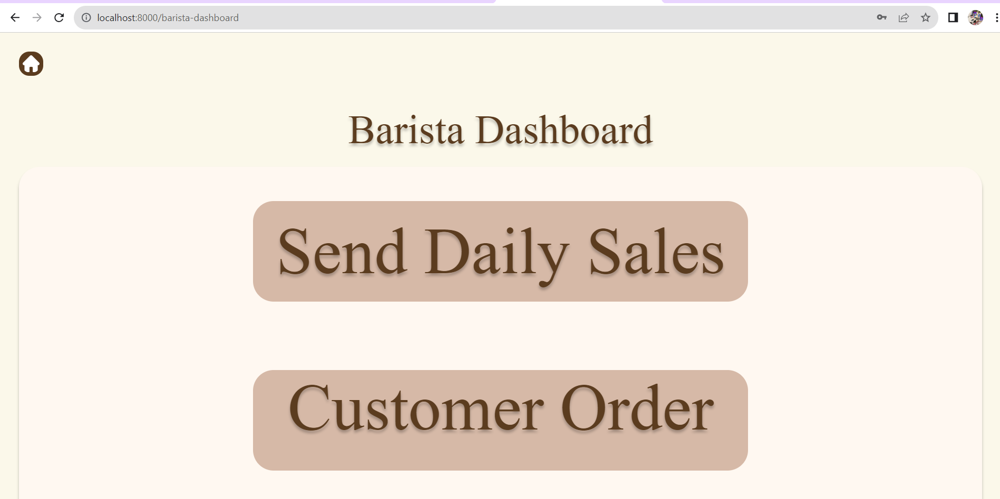
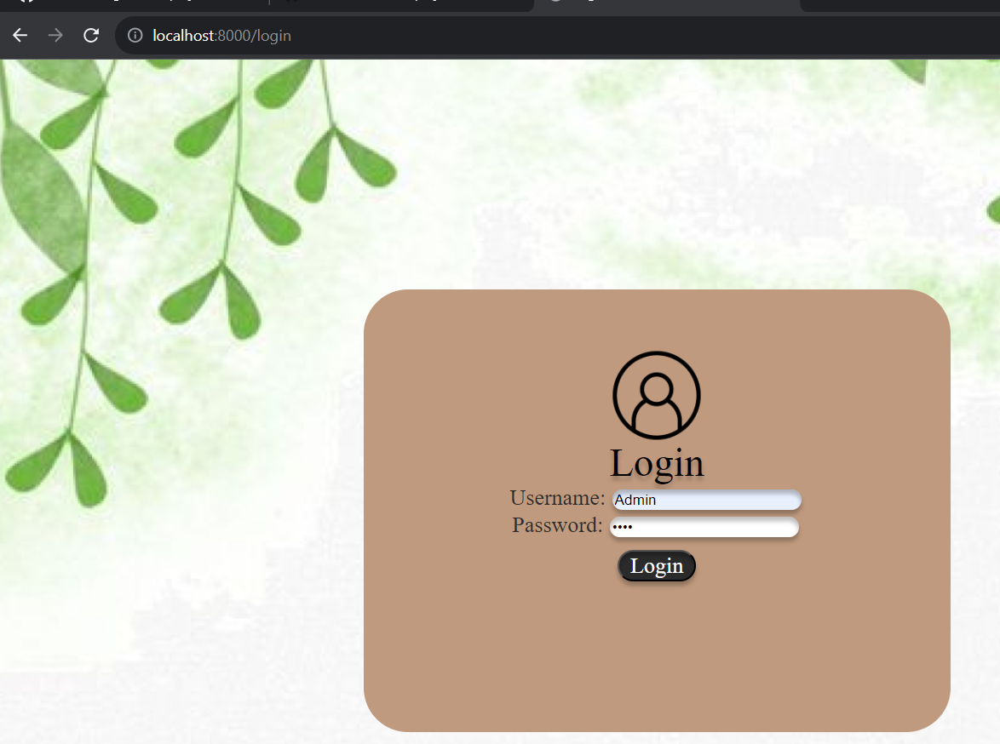
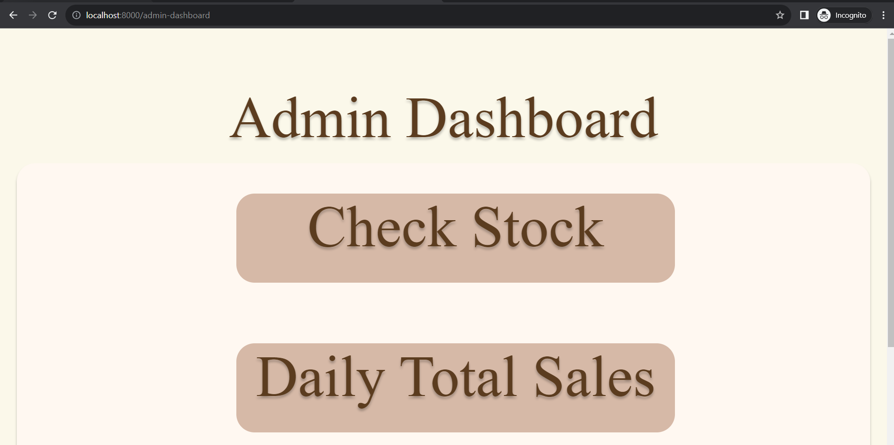
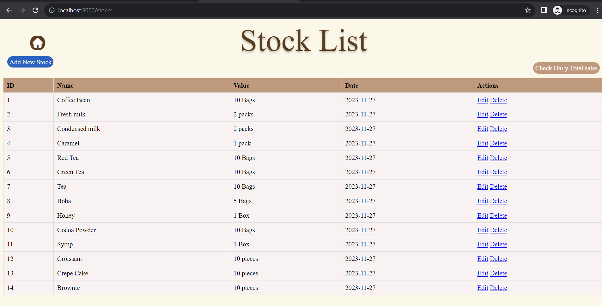

Project
=============
Please use this template for your project.

List your group's member's below with ID and name.

6531503025 Nutthanun Pengpala

6531503096 Krittaya Phirason

6531503101 Nutchanun Uttama

6531503105 Thanakrit Sittipornrattanamanee

6531503108 Teetat Teerawaropas

6531503119 Rawikorn Nuntawong

====================================================================================================

For our project, we have been tasked with developing a system called the Cafe Management System. This system will allow our customers to access our menu through the website that we have created. Our stakeholders have specified three roles that should be implemented in the system: 1. Customer, 2. Barista, and 3. Admin. Let's take a look at each role:

# 1. Customer 

In the Customer section, we haven't done much in terms of functionality because we focused mostly on the HTML pages, using JavaScript to assist, and decorating our homepage with CSS. However, we have created domains related to Customer, including Cart, Customer, User, and Menu.

If you guy want to visit our website u can type with localhost:8100/view that we already set it in UserController Line  /42 Get mapping (/view)

The Example will be like this when you run our website
//(if you guy can't run it with Maven spring boot with port 8100 you can changes port in anything you want from apllication.properties )

# 2. Barista

For the role of the Barista, the responsibility involves receiving notifications from customers when they place orders. The order details will be displayed on the Barista's webpage. In this Barista section, we have implemented a login system. By logging in with the credentials (username: Barista, password: 1234) at localhost:8100/login, you can access the Barista functionalities. Upon successful login, you will be directed to the Barista Dashboard webpage.

The Barista Dashboard will showcase information about which customers ordered what items. Additionally, there is a feature to submit the daily total sales to the admin through a system named "Send daily total sales." You can also log out to return to the login page.

In summary, the Barista Dashboard serves as a central hub for Baristas to view and manage customer orders, report daily sales to the admin, and facilitate the logout process for security.

For the login page it's will show like this you can login with Username: Barista Password : 1234

 
For the Barista dashboard it will show like this so you can easily know what barista need to do

# 3. Admin
For the Admin role, the responsibilities include checking the stock status daily, monitoring incoming and remaining items. The Admin has the capability to add new stock, edit existing stock details, or delete unnecessary stock items. This allows the Admin to manage the inventory effectively, adding or removing items as needed.

Additionally, the Admin can check the daily total sales through a function named "Check Daily Total Sale." This information is obtained through the Barista interface. The Admin has the ability to review the daily sales figures, ensuring accurate records of the cafe's financial performance.

In summary, the Admin role involves inventory management tasks such as checking, adding, editing, and deleting stock items. Furthermore, the Admin can monitor the daily total sales received through the "Check Daily Total Sale" function, facilitated by communication with the Barista.

For the login page it's will show like this you can login with Username: Admin Password : 1234

For the function that admin can do is they can Add edit stock like we already mention it

# 4. The Things That We can't do

The current issue we are facing is the inability to transfer data within our system. We are unsure of the methods to send data after a customer places an order, ensuring that this information appears on the Barista's interface. Similarly, for the Barista, we are uncertain about how to send daily sales data to the Admin. We are seeking guidance on how to address these challenges.

# 5. Challenges!!!!.

If you guy know how to transfer data please contact 6531503105@lamduan.mfu.ac.th 